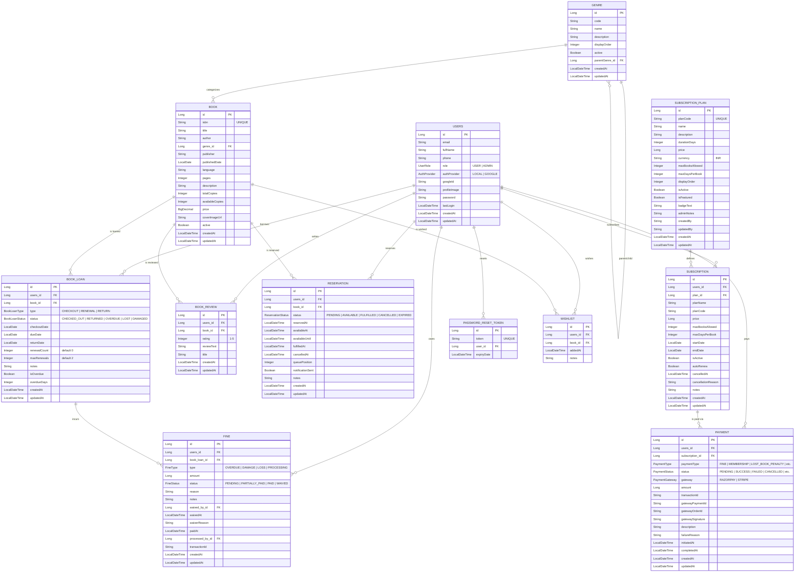
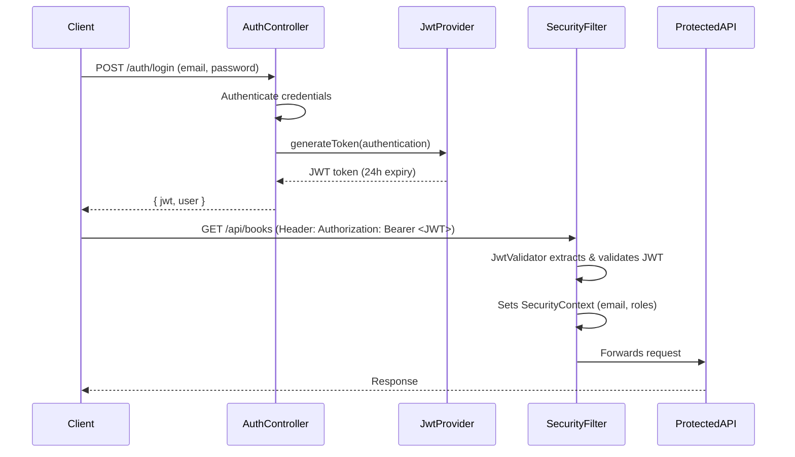

# library_management_backend

# 📚 Library Management System — Backend Documentation

> **Tech Stack:** Spring Boot 3.2.5 · Java 21 · PostgreSQL · Spring Security + JWT · RazorPay · Spring Mail · Lombok

---

## Table of Contents

1. [Project Overview](#project-overview)
2. [Configuration](#configuration)
3. [Database Schema (Entity Relationship)](#database-schema)
4. [API Endpoints](#api-endpoints)
5. [Security & Authentication](#security--authentication)
6. [Package Structure](#package-structure)
7. [Detailed Component Reference](#detailed-component-reference)

---

## Project Overview

A full-featured Library Management System backend with:

- **User authentication** (signup, login, password reset via email)
- **Book catalog management** (CRUD, search, filters, bulk create)
- **Book loan lifecycle** (checkout → renew → checkin, overdue detection)
- **Reservation system** (queue-based reservations with fulfillment)
- **Subscription plans** (membership tiers with duration/book limits)
- **Payment integration** (RazorPay payment links, verification)
- **Fines** (overdue/damage/loss fines, pay or waive)
- **Reviews & Wishlists** (user book reviews, personal wishlists)
- **Email notifications** (password reset, payment reminders)
- **Admin features** (role-based access, admin-only endpoints)

---

## Configuration

### [application.properties](file:///home/manish/Downloads/Library%20Management%20System/Library_Backend/src/main/resources/application.properties)

| Property | Value | Purpose |
|---|---|---|
| `server.port` | `8082` | Application port |
| `spring.datasource.url` | `jdbc:postgresql://localhost:5432/library` | PostgreSQL database URL |
| `spring.datasource.username` | `spring` | DB username |
| `spring.datasource.password` | `Manish7200` | DB password |
| `spring.jpa.hibernate.ddl-auto` | [update](file:///home/manish/Downloads/Library%20Management%20System/Library_Backend/src/main/java/com/hacktropia/controller/BookController.java#42-50) | Auto-creates/updates tables from entities |
| `spring.jpa.show-sql` | `true` | Logs SQL queries |
| `spring.sql.init.mode` | `always` | Runs SQL init scripts on startup |
| `spring.mail.host` | `smtp.gmail.com` | Gmail SMTP for emails |
| `spring.mail.port` | `587` | SMTP port (TLS) |
| `spring.mail.username` | `luvag0707@gmail.com` | Sender email |
| `razorpay.key.id` | *(to configure)* | RazorPay API key |
| `razorpay.key.secret` | *(to configure)* | RazorPay secret |
| `razorpay.callback.base-url` | `http://localhost:5173` | Frontend callback URL after payment |

### Dependencies ([pom.xml](file:///home/manish/Downloads/Library%20Management%20System/Library_Backend/pom.xml))

| Dependency | Purpose |
|---|---|
| `spring-boot-starter-web` | REST API, embedded Tomcat |
| `spring-boot-starter-data-jpa` | ORM / database access via Hibernate |
| `spring-boot-starter-security` | Authentication & authorization |
| `spring-boot-starter-validation` | Bean validation (`@NotNull`, `@Min`, etc.) |
| `spring-boot-starter-mail` | Email sending |
| `postgresql` | PostgreSQL JDBC driver |
| `lombok` (1.18.32) | Boilerplate reduction (`@Getter`, `@Builder`, etc.) |
| `jjwt-api/impl/jackson` (0.12.6) | JWT token creation & validation |
| `razorpay-java` (1.4.8) | RazorPay payment gateway SDK |
| `spring-boot-devtools` | Hot-reload during development |

### Startup Initialization

[DataInitializationComponent.java](file:///home/manish/Downloads/Library%20Management%20System/Library_Backend/src/main/java/com/hacktropia/service/impl/DataInitializationComponent.java) — Creates a default **ADMIN** user on first startup:
- Email: `luvag0707@gmail.com`, Password: `luv`, Role: `ADMIN`

---

## Database Schema

### ER Diagram



### Domain Enums

| Enum | Values |
|---|---|
| `UserRole` | `USER`, `ADMIN` |
| `AuthProvider` | `LOCAL`, `GOOGLE` |
| `BookLoanStatus` | `CHECKED_OUT`, `RETURNED`, `OVERDUE`, `LOST`, `DAMAGED` |
| `BookLoanType` | `CHECKOUT`, `RENEWAL`, `RETURN` |
| `FineStatus` | `PENDING`, `PARTIALLY_PAID`, `PAID`, `WAIVED` |
| `FineType` | `OVERDUE`, `DAMAGE`, `LOSS`, `PROCESSING` |
| `PaymentStatus` | `PENDING`, `SUCCESS`, `FAILED`, `CANCELLED`, `PROCESSING`, `REFUNDED` |
| `PaymentType` | `FINE`, `MEMBERSHIP`, `LOST_BOOK_PENALTY`, `DAMAGED_BOOK_PENALTY`, `REFUND` |
| `PaymentGateway` | `RAZORPAY`, `STRIPE` |
| `ReservationStatus` | `PENDING`, `AVAILABLE`, `FULFILLED`, `CANCELLED`, `EXPIRED` |

---

## API Endpoints

### 🔓 Authentication (`/auth`) — *No auth required*

| Method | Endpoint | Description | Request Body |
|---|---|---|---|
| POST | `/auth/signup` | Register new user | `UserDTO` (email, password, fullName, phone) |
| POST | `/auth/login` | Login & get JWT | `LoginRequest` (email, password) |
| POST | `/auth/forgot-password` | Send reset email | `ForgotPasswordRequest` (email) |
| POST | `/auth/reset-password` | Reset password with token | `ResetPasswordRequest` (token, password) |

**Response:** `AuthResponse` — `{ jwt, message, title, user }` 

---

### 📖 Books (`/api/books`) — *Auth required*

| Method | Endpoint | Description |
|---|---|---|
| POST | `/api/books/bulk` | Bulk create books |
| POST | `/api/books/{id}` | Get book by ID |
| PUT | `/api/books/{id}` | Update book |
| DELETE | `/api/books/{id}` | Soft delete book |
| DELETE | `/api/books/{id}/permanent` | Hard delete book |
| GET | `/api/books` | Search books (query params: `genreId`, `availableOnly`, `activeOnly`, `page`, `size`, `sortBy`, `sortDirection`) |
| POST | `/api/books/search` | Advanced search (body: `BookSearchRequest`) |
| GET | `/api/books/stats` | Get book statistics (total active, total available) |

### 📖 Admin Books (`/api/admin/books`) — *ADMIN role required*

| Method | Endpoint | Description |
|---|---|---|
| POST | `/api/admin/books` | Create a single book |

---

### 📚 Book Loans (`/api/book-loans`) — *Auth required*

| Method | Endpoint | Description |
|---|---|---|
| POST | `/api/book-loans/checkout` | Checkout book for current user |
| POST | `/api/book-loans/checkout/user/{userId}` | Admin: checkout book for specific user |
| POST | `/api/book-loans/checkin` | Return a book |
| POST | `/api/book-loans/renew` | Renew a book loan |
| GET | `/api/book-loans/my` | Get my book loans (filter by `status`, `page`, `size`) |
| POST | `/api/book-loans/search` | Search all book loans (`BookLoanSearchRequest`) |
| POST | `/api/book-loans/admin/update-overdue` | Admin: update overdue statuses |

**Business Rules:**
- Max 2 renewals per loan
- Requires active subscription matching `maxBooksAllowed` / `maxDaysPerBook`
- Due date = checkout date + subscription's `maxDaysPerBook`
- Overdue detection updates status from `CHECKED_OUT` → `OVERDUE`

---

### ⭐ Book Reviews (`/api/reviews`) — *Auth required*

| Method | Endpoint | Description |
|---|---|---|
| POST | `/api/reviews` | Create a review (must have previously returned the book) |
| PUT | `/api/reviews/{id}` | Update own review |
| DELETE | `/api/reviews/{reviewId}` | Delete own review |
| GET | `/api/reviews/book/{bookId}` | Get reviews for a book (paginated) |

**Rules:** Rating 1-5, review text 10-2000 chars, one review per user per book, must have read (returned) the book.

---

### 💰 Fines (`/api/fines`) — *Auth required*

| Method | Endpoint | Description |
|---|---|---|
| POST | `/api/fines` | Create a fine |
| POST | `/api/fines/{id}/pay` | Pay a fine (creates RazorPay payment link) |
| POST | `/api/fines/waive` | Admin: waive a fine |
| GET | `/api/fines/my` | Get my fines (filter by `status`, `type`) |
| GET | `/api/fines` | Admin: get all fines (filter by `status`, `type`, `userId`, paginated) |

---

### 📂 Genres (`/api/genres`) — *Auth required*

| Method | Endpoint | Description |
|---|---|---|
| POST | `/api/genres` | Create genre |
| GET | `/api/genres` | Get all genres |
| GET | `/api/genres/{genreId}` | Get genre by ID |
| PUT | `/api/genres/{genreId}` | Update genre |
| DELETE | `/api/genres/{genreId}` | Soft delete |
| DELETE | `/api/genres/{genreId}/hard` | Hard delete |
| GET | `/api/genres/top-level` | Get top-level genres (no parent) |
| GET | `/api/genres/count` | Total active genres count |
| GET | `/api/genres/{id}/book-count` | Book count in a genre |

**Supports hierarchical genre tree** (parent-child relationships).

---

### 💳 Payments (`/api/payments`) — *Auth required*

| Method | Endpoint | Description |
|---|---|---|
| POST | `/api/payments/verify` | Verify a RazorPay payment |
| GET | `/api/payments` | Get all payments (paginated, sorted) |

**Payment flow:**
1. Subscription/Fine triggers `PaymentService.initiatePayment()`
2. `RazorpayService.createPaymentLink()` creates a RazorPay payment link
3. User completes payment on RazorPay
4. Frontend calls `/api/payments/verify` with `razorpayPaymentId`
5. Backend verifies via RazorPay API, fires `PaymentSuccessEvent`
6. `PaymentEventListener` handles post-payment actions (activates subscription, marks fine as paid)

---

### 📋 Reservations (`/api/reservations`) — *Auth required*

| Method | Endpoint | Description |
|---|---|---|
| POST | `/api/reservations` | Create reservation for current user |
| POST | `/api/reservations/user/{userId}` | Create reservation for specific user |
| DELETE | `/api/reservations/{id}` | Cancel reservation |
| POST | `/api/reservations/{id}/fulfill` | Fulfill reservation (auto-checks out book) |
| GET | `/api/reservations/my` | Get my reservations (filtered, paginated) |
| GET | `/api/reservations` | Search all reservations (admin, filtered, paginated) |

**Rules:** Max 5 active reservations per user, book must have 0 available copies, no duplicate reservations, queue-based ordering.

---

### 🏷️ Subscription Plans (`/api/subscription-plans`)

| Method | Endpoint | Auth |
|---|---|---|
| GET | `/api/subscription-plans` | Authenticated |
| POST | `/api/subscription-plans/admin/create` | ADMIN |
| PUT | `/api/subscription-plans/admin/{id}` | ADMIN |
| DELETE | `/api/subscription-plans/admin/{id}` | ADMIN |

---

### 📦 Subscriptions (`/api/subscriptions`) — *Auth required*

| Method | Endpoint | Description |
|---|---|---|
| POST | `/api/subscriptions/subscribe` | Subscribe to a plan (initiates payment) |
| GET | `/api/subscriptions/user/active` | Get active subscription |
| GET | `/api/subscriptions/admin` | Get all subscriptions |
| GET | `/api/subscriptions/admin/deactivate-expired` | Deactivate expired subscriptions |
| POST | `/api/subscriptions/cancel/{subscriptionId}` | Cancel subscription |
| POST | `/api/subscriptions/activate` | Activate subscription after payment |

---

### 👤 Users (`/api/users`) — *Auth required*

| Method | Endpoint | Description |
|---|---|---|
| GET | `/api/users/list` | Get all users |
| GET | `/api/users/profile` | Get current user profile |

---

### ❤️ Wishlist (`/api/wishlist`) — *Auth required*

| Method | Endpoint | Description |
|---|---|---|
| POST | `/api/wishlist/add/{bookId}` | Add book to wishlist |
| DELETE | `/api/wishlist/remove/{bookId}` | Remove from wishlist |
| GET | `/api/wishlist/my-wishlist` | Get my wishlist (paginated) |

---

### 🏠 Home (Root) — *Public*

| Method | Endpoint | Description |
|---|---|---|
| GET | `/` | Welcome message |
| GET | `/health` | Health check |

---

## Security & Authentication

### JWT Flow



### Security Configuration

| Setting | Value |
|---|---|
| Session | **Stateless** (no server sessions) |
| CSRF | **Disabled** (JWT-based) |
| Password encoding | **BCrypt** |
| JWT expiry | **24 hours** |
| JWT secret | HMAC-SHA key from `JwtConstant.SECRET_KEY` |
| CORS origins | `http://localhost:5173`, `https://library.com` |

### Role-Based Access

| URL Pattern | Access |
|---|---|
| `/api/subscription-plans/admin/**` | `ROLE_ADMIN` only |
| `/api/admin/**` | `ROLE_ADMIN` only |
| `/api/**` | Authenticated users |
| Everything else (`/`, `/auth/**`, `/health`) | Public |

---

## Package Structure

```
com.hacktropia
├── LibraryManagementSystemApplication.java     # Main entry point (@EnableAsync)
│
├── configration/                               # Security & JWT configuration
│   ├── SecurityConfig.java                     # Filter chain, CORS, password encoder
│   ├── JwtConstant.java                        # JWT header name & secret key
│   ├── JwtProvider.java                        # Token generation & email extraction
│   └── JwtValidator.java                       # Request filter — validates JWT on every request
│
├── controller/                                 # REST API endpoints (14 controllers)
│   ├── AuthController.java                     # Signup, login, password reset
│   ├── AdminBookController.java                # Admin book creation
│   ├── BookController.java                     # Book CRUD, search, stats
│   ├── BookLoanController.java                 # Checkout, checkin, renew, overdue
│   ├── BookReviewController.java               # Review CRUD
│   ├── FineController.java                     # Fine creation, payment, waiver
│   ├── GenreController.java                    # Genre CRUD, hierarchy
│   ├── HomeController.java                     # Health check & welcome
│   ├── PaymentController.java                  # Payment verification
│   ├── ReservationController.java              # Reservation lifecycle
│   ├── SubscriptionController.java             # Subscription management
│   ├── SubscriptionPlanController.java         # Admin plan management
│   ├── UserController.java                     # User profile & listing
│   └── WishlistController.java                 # Wishlist management
│
├── domain/                                     # Enums (10 enums)
│   ├── AuthProvider.java                       # LOCAL, GOOGLE
│   ├── BookLoanStatus.java                     # CHECKED_OUT, RETURNED, OVERDUE, LOST, DAMAGED
│   ├── BookLoanType.java                       # CHECKOUT, RENEWAL, RETURN
│   ├── FineStatus.java                         # PENDING, PARTIALLY_PAID, PAID, WAIVED
│   ├── FineType.java                           # OVERDUE, DAMAGE, LOSS, PROCESSING
│   ├── PaymentGateway.java                     # RAZORPAY, STRIPE
│   ├── PaymentStatus.java                      # PENDING, SUCCESS, FAILED, CANCELLED, PROCESSING, REFUNDED
│   ├── PaymentType.java                        # FINE, MEMBERSHIP, LOST_BOOK_PENALTY, DAMAGED_BOOK_PENALTY, REFUND
│   ├── ReservationStatus.java                  # PENDING, AVAILABLE, FULFILLED, CANCELLED, EXPIRED
│   └── UserRole.java                           # USER, ADMIN
│
├── event/                                      # Spring Application Events
│   ├── listener/PaymentEventListener.java      # Handles payment success → activates subscription / marks fine paid
│   └── publisher/PaymentEventPublisher.java    # Publishes payment success events
│
├── exception/                                  # Custom exceptions & global handler
│   ├── BookException.java
│   ├── GenreException.java
│   ├── GlobalException.java                    # @ControllerAdvice — handles validation & custom errors
│   ├── SubscriptionException.java
│   └── UserException.java
│
├── mapper/                                     # Entity ↔ DTO converters (11 mappers)
│   ├── BookLoanMapper.java
│   ├── BookMapper.java
│   ├── BookReviewMapper.java
│   ├── FineMapper.java
│   ├── GenreMapper.java
│   ├── PaymentMapper.java
│   ├── ReservationMapper.java
│   ├── SubscriptionMapper.java
│   ├── SubscriptionPlanMapper.java
│   ├── UserMapper.java
│   └── WishlistMapper.java
│
├── modal/                                      # JPA Entity classes (12 entities)
│   ├── Book.java
│   ├── BookLoan.java
│   ├── BookReview.java
│   ├── Fine.java
│   ├── Genre.java
│   ├── PasswordResetToken.java
│   ├── Payment.java
│   ├── Reservation.java
│   ├── Subscription.java
│   ├── SubscriptionPlan.java
│   ├── Users.java
│   └── Wishlist.java
│
├── payload/                                    # DTOs, Requests, Responses
│   ├── dto/                                    # Data Transfer Objects
│   │   ├── BookDTO.java
│   │   ├── BookLoanDTO.java
│   │   ├── BookReviewDTO.java
│   │   ├── FineDTO.java
│   │   ├── GenreDTO.java
│   │   ├── PaymentDTO.java
│   │   ├── ReservationDTO.java
│   │   ├── SubscriptionDTO.java
│   │   ├── SubscriptionPlanDTO.java
│   │   ├── UserDTO.java
│   │   └── WishlistDTO.java
│   ├── request/                                # Request payloads
│   │   ├── BookLoanSearchRequest.java
│   │   ├── BookSearchRequest.java
│   │   ├── CheckinRequest.java
│   │   ├── CheckoutRequest.java
│   │   ├── CreateFineRequest.java
│   │   ├── CreateReviewRequest.java
│   │   ├── ForgotPasswordRequest.java
│   │   ├── LoginRequest.java
│   │   ├── PaymentInitiateRequest.java
│   │   ├── PaymentVerifyRequest.java
│   │   ├── RenewalRequest.java
│   │   ├── ReservationRequest.java
│   │   ├── ReservationSearchRequest.java
│   │   ├── ResetPasswordRequest.java
│   │   ├── WaiveFineRequest.java
│   │   └── updateReviewRequest.java
│   └── response/                               # Response payloads
│       ├── ApiResponse.java                    # { message, status }
│       ├── AuthResponse.java                   # { jwt, message, title, user }
│       ├── PageResponse.java                   # { content, pageNumber, pageSize, totalElements, ... }
│       ├── PaymentInitiateResponse.java        # { paymentId, gateway, checkoutUrl, ... }
│       └── PaymentLinkResponse.java            # { payment_link_url, payment_link_id }
│
├── repository/                                 # Spring Data JPA repositories (12 repos)
│   ├── BookLoanRepository.java                 # Custom queries: findOverdue, findByDateRange, countActiveByUser
│   ├── BookRepository.java                     # Custom: searchWithFilters, countActive, countAvailable
│   ├── BookReviewRepository.java               # existsByUsersIdAndBookId, findByBook
│   ├── FineRepository.java                     # findAllWithFilters (JPQL with dynamic params)
│   ├── GenreRepository.java                    # findByParent, countActive
│   ├── PasswordResetTokenRepository.java       # findByToken
│   ├── PaymentRepository.java                  # Basic JPA
│   ├── ReservationRepository.java              # hasActiveReservation, countActive, searchWithFilters
│   ├── SubscriptionPlanRepository.java         # existsByPlanCode, findByPlanCode
│   ├── SubscriptionRepository.java             # findActiveByUserId, findExpiredActive
│   ├── UserRepository.java                     # findByEmail
│   └── WishlistRepository.java                 # findByUsersId, existsByUsersIdAndBookId
│
└── service/                                    # Business logic
    ├── AuthService.java                        # Interface
    ├── BookLoanService.java                    # Interface
    ├── BookReviewService.java                  # Interface
    ├── BookService.java                        # Interface
    ├── EmailService.java                       # Interface
    ├── FineService.java                        # Interface
    ├── GenreService.java                       # Interface
    ├── PaymentService.java                     # Interface
    ├── ReservationService.java                 # Interface
    ├── SubscriptionPlanService.java            # Interface
    ├── SubscriptionService.java                # Interface
    ├── UserService.java                        # Interface
    ├── WishlistService.java                    # Interface
    ├── gateway/
    │   └── RazorpayService.java                # RazorPay payment link creation & verification
    └── impl/
        ├── AuthServiceImpl.java                # Login, signup, password reset
        ├── BookLoanServiceImpl.java            # Checkout/checkin/renew with subscription validation
        ├── BookReviewServiceImpl.java          # Review CRUD with "must have read book" validation
        ├── BookServiceImpl.java                # Book CRUD, search with dynamic filters
        ├── CustomUserServiceImplementation.java # UserDetailsService for Spring Security
        ├── DataInitializationComponent.java    # Creates default admin on startup
        ├── EmailServiceImpl.java               # SMTP email sending
        ├── FineServiceImpl.java                # Fine creation, payment, waiver
        ├── GenreServiceImpl.java               # Genre CRUD with hierarchy
        ├── PaymentServiceImpl.java             # Payment initiation & RazorPay verification
        ├── ReservationServiceImpl.java         # Reservation lifecycle with queue management
        ├── SubscriptionImpl.java               # Subscribe, activate, cancel, deactivate expired
        ├── SubscriptionPlanServiceImpl.java    # Plan CRUD
        ├── UserServiceImpl.java                # Current user from JWT, user listing
        └── WishlistServiceImpl.java            # Wishlist add/remove
```

---

## Detailed Component Reference

### Key Service Functions

#### `AuthServiceImpl`

| Function | What it does |
|---|---|
| [login(email, password)](file:///home/manish/Downloads/Library%20Management%20System/Library_Backend/src/main/java/com/hacktropia/controller/AuthController.java#32-39) | Authenticates via `CustomUserServiceImplementation`, generates JWT, updates `lastLogin` |
| [signup(UserDTO)](file:///home/manish/Downloads/Library%20Management%20System/Library_Backend/src/main/java/com/hacktropia/controller/AuthController.java#55-64) | Creates user with `ROLE_USER`, hashes password with BCrypt, returns JWT |
| `createPasswordResetToken(email)` | Generates UUID token (5 min expiry), sends reset link via email |
| `resetPassword(token, newPassword)` | Validates token, updates password, deletes token |

#### `BookLoanServiceImpl`

| Function | What it does |
|---|---|
| [checkoutBook(request)](file:///home/manish/Downloads/Library%20Management%20System/Library_Backend/src/main/java/com/hacktropia/controller/BookLoanController.java#25-32) | Validates subscription → checks book availability → decrements `availableCopies` → creates loan with due date |
| [checkoutBookForUser(userId, request)](file:///home/manish/Downloads/Library%20Management%20System/Library_Backend/src/main/java/com/hacktropia/controller/BookLoanController.java#33-43) | Admin variant: checks out book for a specific user |
| `checkinBook(request)` | Returns book → increments `availableCopies` → sets return date |
| `renewCheckout(request)` | Validates renewal eligibility (max 2, not overdue) → extends due date |
| [updateOverdueBookLoan()](file:///home/manish/Downloads/Library%20Management%20System/Library_Backend/src/main/java/com/hacktropia/controller/BookLoanController.java#88-98) | Batch job: finds all `CHECKED_OUT` loans past due date → marks as `OVERDUE` |
| [getMyBookLoans(status, page, size)](file:///home/manish/Downloads/Library%20Management%20System/Library_Backend/src/main/java/com/hacktropia/controller/BookLoanController.java#67-78) | Get current user's loans with optional status filter |

#### `SubscriptionImpl`

| Function | What it does |
|---|---|
| `subscribe(dto)` | Finds plan → creates inactive subscription → initiates RazorPay payment |
| `activateSubscription(id, paymentId)` | Sets `isActive = true`, sets start/end dates |
| `cancelSubscription(id, reason)` | Deactivates subscription with cancellation reason |
| `deactivateExpiredSubscriptions()` | Finds all active subscriptions past `endDate` → deactivates them |

#### `PaymentServiceImpl`

| Function | What it does |
|---|---|
| `initiatePayment(request)` | Creates [Payment](file:///home/manish/Downloads/Library%20Management%20System/Library_Backend/src/main/java/com/hacktropia/modal/Payment.java#13-65) record → calls `RazorpayService.createPaymentLink()` → returns checkout URL |
| `verifyPayment(request)` | Fetches payment from RazorPay API → validates amount/status → publishes `PaymentSuccessEvent` |

#### `PaymentEventListener`

| Event | Action |
|---|---|
| Payment success + type `MEMBERSHIP` | Calls `subscriptionService.activateSubscription()` |
| Payment success + type `FINE` | Calls `fineService.markFineAsPaid()` |

#### `ReservationServiceImpl`

| Function | What it does |
|---|---|
| `createReservation(request)` | Validates: no existing loan, no duplicate reservation, book unavailable, max 5 reservations → assigns queue position |
| `fulfillReservation(id)` | Marks reservation `FULFILLED` → auto-checks out book for user |
| `cancelReservation(id)` | Only own reservations (or admin) → marks `CANCELLED` |

#### `FineServiceImpl`

| Function | What it does |
|---|---|
| [createFine(request)](file:///home/manish/Downloads/Library%20Management%20System/Library_Backend/src/main/java/com/hacktropia/controller/FineController.java#26-33) | Creates fine linked to user and book loan |
| [payFine(id, transactionId)](file:///home/manish/Downloads/Library%20Management%20System/Library_Backend/src/main/java/com/hacktropia/controller/FineController.java#35-43) | Initiates RazorPay payment for fine |
| [waiveFine(request)](file:///home/manish/Downloads/Library%20Management%20System/Library_Backend/src/main/java/com/hacktropia/controller/FineController.java#45-52) | Admin: waives fine with reason |
| `markFineAsPaid(id, amount, transactionId)` | Called by event listener after successful payment |

#### `UserServiceImpl`

| Function | What it does |
|---|---|
| `getCurrentUser()` | Extracts email from JWT in `SecurityContext` → finds user by email |
| `getAllUsers()` | Returns all users as DTOs |

#### `RazorpayService`

| Function | What it does |
|---|---|
| `createPaymentLink(user, payment)` | Creates RazorPay payment link with amount, customer info, callback URL, and metadata |
| `fetchPaymentDetails(paymentId)` | Fetches payment status from RazorPay API |
| `isValidPayment(paymentId)` | Validates payment: checks `captured` status, verifies amount matches plan/fine |
